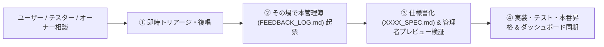

# [プロダクト名] ユーザーフィードバック & 改善要望管理簿 (VoC Log)

**運用開始**: [YYYY年MM月DD日]  
**統括担当**: [PM / 統括担当者名]  

---

## 1. フィードバック運用フロー ＆ 抜け漏れ防止4大プロトコル

### 🛡️ タスク抜け漏れゼロの4大プロトコル:
1. **即時トリアージ＆復唱確認**: 会話の中で出た要望やアイデアは、その場で優先度と実施フェーズを復唱・合意する。
2. **会話のその場で起票**: 後回しにせず、そのターン内で通し番号（`FB-XXX`）を振って本ファイルに記録する。
3. **週次定期点検での放置スキャン**: 毎週月曜朝の定期点検で「起票・仕様策定中」のまま止まっている項目を強制スキャンしてリマインドする。
4. **統括ダッシュボード可視化**: `management.html` 等のダッシュボードと常に同期する。

---

## 2. フィードバック一覧

| ID | 受信日 | ユーザー属性 (友人/テスター/オーナー) | 種別 (UI/バグ/速度/価格感) | 内容・声 | 優先度 (最高/高/中/低) | ステータス (起票/仕様策定中/対応中/完了) | 対応方針・実務担当への指示 |
|:---|:---|:---|:---|:---|:---:|:---:|:---|
| FB-001 | 2026/01/01 | 初期テスター | 認証・UX | テスト環境へのログイン方法が分かりにくい | 高 | 完了 | ログイン画面にワンクリック体験ボタンを設置 (コミットID) |
| FB-002 | 2026/01/02 | オーナー・テスター | バグ・同期 | 実行した履歴やスコアがダッシュボードに反映されない | 最高 | 完了 | リアルタイム保存パイプライン修正＋未同期データの自動レスキュー同期を実装 |
| FB-003 | 2026/01/03 | オーナー・テスター | 価格・顧客管理 | 1日の回数上限をなくして使い放題にし、管理画面で採算限界を監視したい | 最高 | 完了 | 回数上限撤廃。/admin/customers に利用頻度・想定原価・採算リスク自動計算と日次折れ線グラフモーダルを実装 |
| FB-004 | 2026/01/04 | βテスター | 速度改善・コスト | 生成まで5秒ほどかかるのでもどかしい | 最高 | 完了 | クライアント1件先読み（0.0秒遷移）＋DBバンク300件蓄積＆週10%自動ローテーションを実装 |
| FB-005 | 2026/01/05 | オーナー・技術相談 | 開発基盤・新UI | 本番ユーザーに影響を与えずに新UIや新方式をテストしたい | 高 | 完了 | 管理者限定プレビュー（🧪テストボタンモード）を実装し、検証完了後に全ユーザー標準ONへ昇格 |
| FB-006 | YYYY/MM/DD | [属性] | [種別] | [新規フィードバックをここに追記] | [優先度] | [ステータス] | [対応方針・SPECファイル名] |

---

## 3. 重要ヒアリング観点（初期テスターに聞いておきたい3大ポイント）

1. **価値の実感 (Core Value)**:
   - 「このサービスを使った時、一番『自分の課題が分かった』『便利だ』と感じた瞬間はどこでしたか？」
2. **価格の納得感 (Pricing & Willingness to Pay)**:
   - 「無料体験が終わった後、月額[500]円（Base）や月額[1,480]円（Pro）は既存サービスと比べてどう感じますか？」
3. **継続のハードル (Retention & Friction)**:
   - 「明日ももう一度使いたいと思いましたか？待ち時間や操作でストレスを感じた部分はどこですか？」
