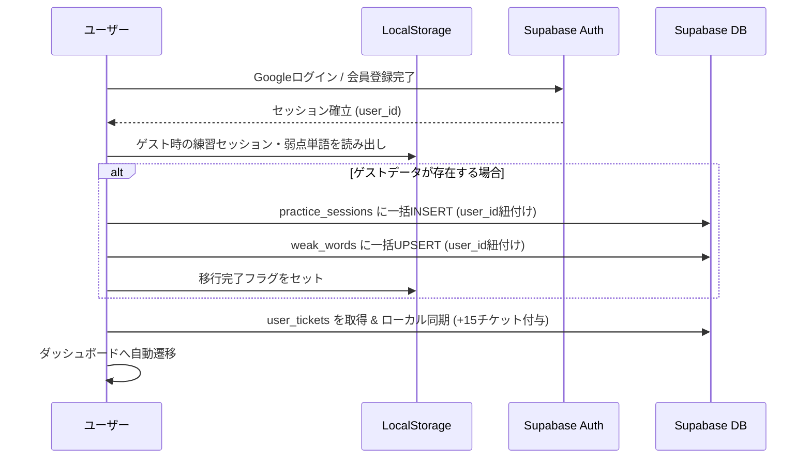

# ShadowLog アカウント管理 ＆ Supabase実連携 仕様書

**作成日**: 2026年9月26日  
**ステータス**: 実装準備完了 (Ready for Implementation)  
**担当**: 実務担当 (Conversation ID: `f203da78-5104-423c-92ad-efa86de6e77a`)  

---

## 1. 背景と目的
VercelとSupabaseプロジェクト（`supabase-bole-harbor`）の疎通・環境変数が確立されたため、モック（LocalStorageオンリー）だったアカウント・データ管理を **Supabase Auth & Database の本番実連携** に切り替える。

- **離脱防止**: ゲストからワンクリック（Google）またはメアドで登録可能にする。
- **データ保護**: ゲスト時の練習履歴・弱点単語を消さずに、登録したSupabaseアカウントへ自動引き継ぎ。
- **マルチデバイス対応**: スマホ・PC間で練習カルテやストリークを完全同期。

---

## 2. 認証方式・画面仕様

### ① ログイン/新規登録（`/login`）の拡充
1. **Googleワンクリックログイン**:
   - `supabase.auth.signInWithOAuth({ provider: 'google', options: { redirectTo: window.location.origin + '/auth/callback' } })`
2. **メールアドレス ＆ パスワード**:
   - 既存のログインフォームに加え、「新規登録（Sign Up）」タブまたはリンクを新設。
   - サインアップ成功時、確認メール送信または即時セッション確立。
3. **VIPクイックログイン（テスター用）**:
   - 既存の `shadowlog.app@gmail.com` ボタンを維持（開発・審査時のワンタップ検証）。

---

## 3. ゲストデータ自動引き継ぎフロー (Data Migration)

ユーザーがゲスト（未登録）から「ログインまたは新規登録」を完了した瞬間に実行：

---

## 4. データベース同期（オフライン・オンライン二重化）

1. **練習完了時（`/practice`）**:
   - まずローカル（LocalStorage / IndexedDB）に即時書き込み（UIのミリ秒レスポンスを保証）。
   - `navigator.onLine` かつログイン済みの場合は、非同期でSupabaseの `practice_sessions` および `weak_words` に保存。
2. **履歴画面表示時（`/review`）**:
   - ログイン時はSupabaseから最新セッション一覧を取得してローカルキャッシュを更新。
   - オフライン時はローカルキャッシュから即時レンダリング（📶オフラインバナー表示）。

---

## 5. 実装タスク一覧

1. [ ] `supabase/schema.sql` のテーブル定義がSupabaseに反映されていることを確認
2. [ ] `/login` 画面に「Googleでログイン」ボタンおよび「新規登録」切り替えUIを実装
3. [ ] `/auth/callback/route.ts` でOAuthトークン交換とセッション確立処理を整備
4. [ ] ゲストデータ引き継ぎユーティリティ（`src/lib/storage/sync-service.ts`）の実装
5. [ ] 練習完了時およびカルテ表示時のSupabase自動保存・同期処理の統合
6. [ ] 単体テスト実行 ＆ GitHubプッシュ ＆ Vercel自動デプロイ
