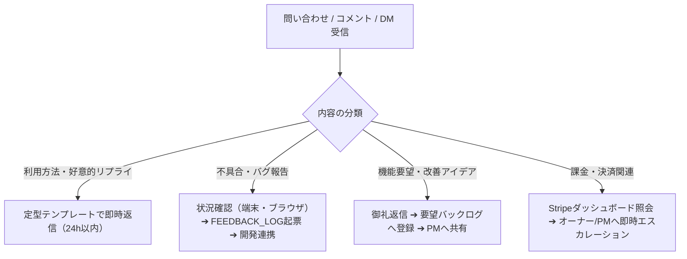

# ShadowLog 顧客管理 (CRM / CS) 業務台帳 ＆ 体制整理書

**着任日**: 2026年9月26日  
**担当**: 顧客管理担当 (CRM / CS)  
**統括・連携先**: 総括 (Director / PM)、広報担当 (PR / SNS)、実務・開発担当  

---

## 1. 顧客管理担当としてのミッション

1. **登録者・ユーザーの安心サポート**:
   - アカウント登録時、ログイン不具合、操作方法に関する問い合わせへの迅速かつ丁寧な一次対応。
2. **VoC (Voice of Customer / 顧客の声) の収集と還元**:
   - SNS（Threads / Instagram）、LP問い合わせ、アプリ内導線から寄せられる意見・不具合報告・要望を一元管理し、開発・PMへ迅速にエスカレーション。
3. **継続率（リテンション）向上とオンボーディング**:
   - 無料チケット（ゲスト5回 ➔ 登録+15回）から有料プランへの移行サポート、ストリーク（学習継続日数）を途切れさせないサポート体制の構築。

---

## 2. 広報 (PR) 連携情報まとめ

| 項目 | 現状・詳細 | 顧客管理 (CRM) でのアクション |
| :--- | :--- | :--- |
| **公式アカウント** | **Threads & Instagram**: `@shadowlog_official` ※認証情報は `management/ACCOUNTS.local.md` にて厳重保管 | メンション、リプライ、DMを定期巡回・一次返信 |
| **広報発信状況** | Threadsにて初期投稿2件発信済み（累計84 Imp）。 「通勤×習慣化」テーマで78閲覧と高い関心。 | 投稿に寄せられた「使ってみたい」「英語の悩み」コメントをピックアップして会話開始 |
| **プロフィール導線** | LP・WebアプリのURL設置済み | LP来訪者が迷わず体験できるよう、使い方Tipsを準備 |
| **初期投稿ロードマップ** | Day 1: 立ち上げ宣言 Day 2: シャドーイングのペイン問いかけ Day 3: 文字起こし＆Diff機能デモ Day 4: 脱落しやすい前置詞Tips Day 5: 開発裏側＆新機能アンケート | 各投稿のコメント欄で学習者と積極交流し、要望をVoCログ（`FEEDBACK_LOG.md`）へ蓄積 |

---

## 3. アカウント・登録基盤の現状整理

| 区分 | 仕様・特典 | CRM対応ポイント |
| :--- | :--- | :--- |
| **ゲスト（未登録）** | **無料 5回まで体験可能** | 5回消化前後に「無料登録で+15回＆履歴クラウド保存」を案内 |
| **無料会員（登録済）** | **追加 15回無料（累計20回）** + Pro長文モード味見2回分 | ゲスト時のデータ自動引き継ぎ完了を確認。 Googleワンクリックまたはメアド登録で即時利用可能 |
| **有料プラン（検討中・契約者）** | **Basic (月500円/1日30回)** **Pro (月1,480円/完全無制限)** | Stripe Checkout決済連携済み。請求や領収書、プラン変更などの問い合わせ対応 |
| **VIPテスター** | クイックログイン（特定ホワイトリスト） | テスター向けの検証環境案内、ヒアリングの実施 |

---

## 4. 顧客対応（CS）標準フロー＆テンプレート

### ① 問い合わせ・DM一次対応フロー

### ② 主要対応テンプレート
- **初回フォロー・利用開始への歓迎**:
  > 「フォロー（ご利用）ありがとうございます！ShadowLog公式です🎙️ 忙しい日常の中でも『声に出す英語』が無理なく習慣になるようサポートいたします。使ってみての感想や『こんな機能・英文が欲しい』などあれば、いつでもお気軽に教えてくださいね！✨」
- **不具合・動作不良のご報告への返信**:
  > 「貴重なご報告をいただき誠にありがとうございます。ご不便をおかけして大変申し訳ございません。現在開発チームへ連携し、調査・改修を進めております。もし差し支えなければ、ご利用端末（iPhone/Android/PC）やブラウザをお知らせいただけますと幸いです。」
- **機能要望・改善アイデアへの返信**:
  > 「素晴らしいアイデア・ご要望をありがとうございます！さっそくプロダクト改善のバックログに登録させていただきました。今後のアップデートにて検討させていただきますので、楽しみにお待ちいただけますと幸いです🙇‍♂️」

---

## 5. 顧客管理台帳（VoC & ユーザー対応ログ）

既存の管理ファイルと連携して運用します：
- **`management/FEEDBACK_LOG.md`**: テスターおよびユーザーからの改善要望・不具合管理（FB-001〜FB-009 記録中）
- **`management/CUSTOMER_FEEDBACK.md`**: 問い合わせ・DMログ詳細
- **`management/ANALYTICS.md`**: 反響・インプレッション分析

---

## 6. 顧客管理担当としての今後のアクションプラン

1. **登録者の受け入れ準備完了**:
   - Supabase実連携デプロイ完了に伴い、新規登録者の増加に対応可能。
2. **テスター・初期登録者へのフォローアップ**:
   - 3大ヒアリング（①発音差分Diffの納得感、②チケット・価格の妥当性、③明日も続けたいか）を軸としたVoC収集。
3. **広報担当との密なデイリー連携**:
   - Threads投稿に対するコメントやリアクションを毎日チェックし、24時間以内の返信を徹底。
