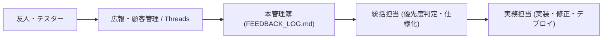

# ShadowLog クローズドβ ユーザーフィードバック & 改善要望管理簿

**運用開始**: 2026年9月25日  
**統括担当**: Antigravity Management  

---

## 1. フィードバック運用フロー

---

## 2. フィードバック一覧

| ID | 受信日 | ユーザー属性 (友人/テスター) | 種別 (UI/バグ/機能要望/価格感) | 内容・声 | 優先度 (高/中/低) | ステータス (起票/対応中/完了) | 対応方針・実務担当への指示 |
|:---|:---|:---|:---|:---|:---:|:---:|:---|
| FB-001 | 2026/09/25 | オーナー・テスター | AI生成・多様性 | API生成のたびに同じような問題が出てくる | 高 | 完了 | temperature 0.85 & ランダムシチュエーション注入で多様性向上 (1279c59) |
| FB-002 | 2026/09/25 | オーナー・テスター | 認証・UX | 検証モードへのログイン方法がわからない | 高 | 完了 | ログイン画面に「🧪 VIPテスターとしてクイックログイン」設置 (1279c59) |
| FB-003 | 2026/09/25 | オーナー・テスター | バグ・UX | 1度Shadowingをやってみたのに、ワード数などの実績が反映されない | 最高 | 完了 | 採点完了時にオートセーブ即時反映を実装 (1279c59) |
| FB-004 | 2026/09/25 | オーナー・テスター | 法務・UI | 特定商取引法に基づく表記は決済時画面にのみ表示 | 高 | 完了 | フッターから除外しUpgradeModalのみに配置 (1279c59) |
| FB-005 | 2026/09/25 | オーナー・テスター | コンテンツ拡充 | 英語を学びたい職種分野の問題を拡充、街中会話や友達との会話含む | 高 | 仕様策定中 | 接客・サービス（ホテル・飲食）、日常・カジュアル会話カテゴリを追加 |
| FB-006 | 2026/09/25 | オーナー・テスター | 価格・プラン | ベーシックプランは30回、proプランの回数制限は無くす、もしくは回数を見直す | 高 | 完了 | ベーシックを1日30回に変更、Proプラン完全無制限を強調 (1279c59) |
| FB-007 | 2026/09/25 | オーナー・テスター | 機能要望 | 実践した文章で使用された単語の単語帳やフレーズ集もあるとオフライン時に復習しやすい | 中 | 要件定義中 | 復習カルテ画面に「復習フレーズ・単語集エクスポート / オフライン表示」を追加 |
| FB-008 | 2026/09/25 | オーナー・テスター | アルゴリズム | 単語帳やその人のレベル、過去にトライした問題などを踏まえた問題が生成されるアルゴリズムにしたい | 高 | 仕様策定中 | generate-sentence APIにユーザーのつまずき単語（Weak Words）を注入し自動組み込み |
| FB-009 | 2026/09/25 | オーナー・テスター | 事業戦略 | ロードマップ反映（フェーズ1: IT・メーカー集中 ➔ フェーズ2: 医療・特定業界拡張） | 高 | 完了 | ROADMAP.md に正式統合完了 |

---

## 3. 重要ヒアリング観点（友人・テスターに聞いておきたい3大ポイント）

1. **価値の実感**:
   - 「Whisperでの文字起こしと赤字Diffを見たとき、自分の発音のクセが分かったか？」
2. **チケット・価格の納得感**:
   - 「5回（＋登録後15回）使ってみて、もっと練習したくなったか？」
   - 「月額500円（ライト）や月額1,480円（Pro）は、シャドテン（月2万円）と比べてどう感じるか？」
3. **継続のハードル**:
   - 「明日ももう一度使いたいと思ったか？続けにくいと感じた点はどこか？」
