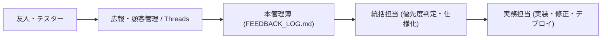

# ShadowLog クローズドβ ユーザーフィードバック & 改善要望管理簿

**運用開始**: 2026年9月25日  
**統括担当**: Antigravity Management  

---

## 1. フィードバック運用フロー

---

## 2. フィードバック一覧

| ID | 受信日 | ユーザー属性 (友人/テスター) | 種別 (UI/バグ/機能要望/価格感) | 内容・声 | 優先度 (高/中/低) | ステータス (起票/対応中/完了) | 対応方針・実務担当への指示 |
|:---|:---|:---|:---|:---|:---:|:---:|:---|
| FB-001 | 2026/09/25 | - | - | （ここに受領したフィードバックを追記します） | - | 起票 | - |

---

## 3. 重要ヒアリング観点（友人・テスターに聞いておきたい3大ポイント）

1. **価値の実感**:
   - 「Whisperでの文字起こしと赤字Diffを見たとき、自分の発音のクセが分かったか？」
2. **チケット・価格の納得感**:
   - 「5回（＋登録後15回）使ってみて、もっと練習したくなったか？」
   - 「月額500円（ライト）や月額1,480円（Pro）は、シャドテン（月2万円）と比べてどう感じるか？」
3. **継続のハードル**:
   - 「明日ももう一度使いたいと思ったか？続けにくいと感じた点はどこか？」
