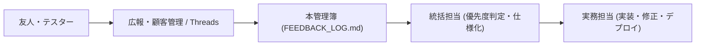

# ShadowLog クローズドβ ユーザーフィードバック & 改善要望管理簿

**運用開始**: 2026年9月25日  
**統括担当**: Antigravity Management  

---

## 1. フィードバック運用フロー

```mermaid
flowchart LR
    User["友人・テスター"] --> PR["広報・顧客管理 / Threads"]
    PR --> Log["本管理簿 (FEEDBACK_LOG.md)"]
    Log --> PM["統括担当 (優先度判定・仕様化)"]
    PM --> Eng["実務担当 (実装・修正・デプロイ)"]
```

---

## 2. フィードバック一覧

| ID | 受信日 | ユーザー属性 (友人/テスター) | 種別 (UI/バグ/機能要望/価格感) | 内容・声 | 優先度 (高/中/低) | ステータス (起票/対応中/完了) | 対応方針・実務担当への指示 |
|:---|:---|:---|:---|:---|:---:|:---:|:---|
| FB-001 | 2026/09/25 | オーナー・テスター | AI生成・多様性 | API生成のたびに同じような問題が出てくる | 高 | 完了 | temperature 0.85 & ランダムシチュエーション注入で多様性向上 (1279c59) |
| FB-002 | 2026/09/25 | オーナー・テスター | 認証・UX | 検証モードへのログイン方法がわからない | 高 | 完了 | ログイン画面に「🧪 VIPテスターとしてクイックログイン」設置 (1279c59) |
| FB-003 | 2026/09/25 | オーナー・テスター | バグ・UX | 1度Shadowingをやってみたのに、ワード数などの実績が反映されない | 最高 | 完了 | 採点完了時にオートセーブ即時反映を実装 (1279c59) |
| FB-004 | 2026/09/25 | オーナー・テスター | 法務・UI | 特定商取引法に基づく表記は決済時画面にのみ表示 | 高 | 完了 | フッターから除外しUpgradeModalのみに配置 (1279c59) |
| FB-005 | 2026/09/25 | オーナー・テスター | コンテンツ拡充 | 英語を学びたい職種分野の問題を拡充、街中会話や友達との会話含む | 高 | 仕様策定中 | 接客・サービス（ホテル・飲食）、日常・カジュアル会話カテゴリを追加 |
| FB-006 | 2026/09/25 | オーナー・テスター | 価格・プラン | ベーシックプランは30回、proプランの回数制限は無くす、もしくは回数を見直す | 高 | 完了 | ベーシックを1日30回に変更、Proプラン完全無制限を強調 (1279c59) |
| FB-007 | 2026/09/25 | オーナー・テスター | 機能要望 | 実践した文章で使用された単語の単語帳やフレーズ集もあるとオフライン時に復習しやすい | 中 | 要件定義中 | 復習カルテ画面に「復習フレーズ・単語集エクスポート / オフライン表示」を追加 |
| FB-008 | 2026/09/25 | オーナー・テスター | アルゴリズム | 単語帳やその人のレベル、過去にトライした問題などを踏まえた問題が生成されるアルゴリズムにしたい | 高 | 仕様策定中 | generate-sentence APIにユーザーのつまずき単語（Weak Words）を注入し自動組み込み |
| FB-009 | 2026/09/25 | オーナー・テスター | 事業戦略 | ロードマップ反映（フェーズ1: IT・メーカー集中 ➔ フェーズ2: 医療・特定業界拡張） | 高 | 完了 | ROADMAP.md に正式統合完了 |
| FB-010 | 2026/09/26 | オーナー・テスター | サポート・UX | アプリ設定の一番下に不具合・質問の報告ボタン・スクショ添付・自動返信・メール通知 | 最高 | 完了 | Resendメール送信・自動返信＋Supabase Storageスクショ保存＋DBログ＋環境情報自動収集を実装 (3fa0d20) |
| FB-011 | 2026/09/27 | オーナー・テスター | ユーザー体験・UX | 設定画面にアカウント情報（メアド、ニックネーム、PW変更、Google連携表示）＆ ダッシュボード最上部に時間帯別挨拶 | 最高 | 実装指示済 | ACCOUNT_AND_GREETING_SPEC.md 作成、実務担当へ実装指示出し |
| FB-012 | 2026/09/27 | オーナー・テスター | 会員登録導線・収益化 | 体験版の人向けにトップ最上部にアカウント作成CTA表示、設定画面下部にコース説明・登録ボタン新設 | 最高 | 実装指示済 | SIGNUP_AND_PLAN_SECTION_SPEC.md 作成、実務担当へ実装指示出し |
| FB-013 | 2026/09/27 | オーナー・テスター | 事業計画・API限界 | 3ヶ月後目標を50人（Basic 45名 / Pro 5名）に設定、最新仕様でのAPI限界値再計算 | 高 | 完了 | simulation.py / README.md / checklist.html / ROADMAP.md を更新・エグゼクティブサマリー報告完了 |
| FB-014 | 2026/09/27 | オーナー・テスター | プロダクト方針・顧客管理 | 1日の使用回数上限を削除（使い放題化）。顧客管理でユーザー利用頻度と採算限界（損益分岐点）を自動計算 | 最高 | 完了 | 有料プラン回数上限撤廃。/admin/customers に「利用頻度(本日/平均)」「想定月間原価」「採算リスク(安全/注意/警戒)」の自動計算・表示を実装 (d78e023) |
| FB-015 | 2026/09/28 | オーナー・テスター | 定期点検・監査 | ①プラン説明の使い放題表記統一、②設定画面に管理者顧客管理導線設置、③アクセス解析のSupabase永続化 | 最高 | 完了 | AUDIT_FIXES_SPEC.md 策定、実務担当にて全3件の実装・ビルド・テスト通過完了 (97a7dee) |
| FB-016 | 2026/09/29 | オーナー・テスター | バグ・解析反映 | アプリ内のWPMデータ収集が機能しておらずダッシュボードに反映されない | 最高 | 完了 | 保存・通信パイプラインおよびローカル読み出しでのWPM受け渡し欠落を解消、テスト拡充 (93 passed) |
| FB-017 | 2026/09/29 | オーナー・テスター | マーケティング・事前登録 | ウェイティングリストLP（/waitlist）作成。14日間無料クーポン、動くUIデモ、Resendサンクスメール自動送信 | 最高 | 完了 | WAITLIST_LP_SPEC.md 策定、/waitlist LP・/api/waitlist・Resendメール・管理画面連携を実装 (99 passed) |
| FB-018 | 2026/09/29 | βテスター（5名） | UI/UX改善 | 「次のフレーズへ」の視認性向上（オレンジ色変更）＆画面下部へのフローティング配置 | 高 | 完了 | 練習結果表示時に浮遊型バー（Floating Next Phrase Bar）を新設、オレンジ色適用・スコア表示付き (9adbb5a) |

---

## 3. 重要ヒアリング観点（友人・テスターに聞いておきたい3大ポイント）

1. **価値の実感**:
   - 「Whisperでの文字起こしと赤字Diffを見たとき、自分の発音のクセが分かったか？」
2. **チケット・価格の納得感**:
   - 「5回（＋登録後15回）使ってみて、もっと練習したくなったか？」
   - 「月額500円（ライト）や月額1,480円（Pro）は、シャドテン（月2万円）と比べてどう感じるか？」
3. **継続のハードル**:
   - 「明日ももう一度使いたいと思ったか？続けにくいと感じた点はどこか？」
