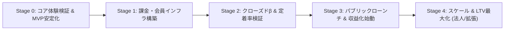

# ShadowLog 収益化・事業推進ロードマップ

**作成日**: 2026年9月24日  
**責任者**: プロジェクト統括担当 (Antigravity)  
**対象プロダクト**: ShadowLog (AIシャドーイング・スピーキング習熟Webサービス)

---

## 1. エグゼクティブ・サマリー

ShadowLogは、既存の「人手による高額シャドーイング（シャドテン: 月額21,780円）」と「フリートークAI英会話（Speak等）」の間に存在する、**「安価に・即時フィードバックで・実践的な英語発話を鍛えたいビジネスパーソン」**の巨大な空白地帯をターゲットにしたSaaSです。

### 収益モデル骨子
- **無料体験 (Guest / Free Tier)**: 累計15回までの体験チケット制。登録ハードルを最小化しバイラルを狙う。
- **無料体験 (Layer 1: ゲスト5回 / Layer 2: 会員登録で+15回 / Pro味見2回)**: 登録ハードルを最小化しバイラルを狙う。
- **ベースプラン (Base)**: **月額 500 円**（年払 4,800 円）
  - 短文シャドーイング、カルテ、**1日30回**（AI原価約289円、粗利率 ~40〜50%）
- **プロプラン (Pro - 主力)**: **月額 1,480 円**（年払 12,800 円）
  - 長文スピーチモード（60〜90語）、業界別専門英文、WPM話速解析、**練習回数 完全無制限**（AI原価約386〜482円、粗利率 ~64〜70%）

---

## 2. ターゲット候補別の特性比較 & 業界展開戦略

| 評価軸 | ① IT・メーカー（技術職・営業） | ② 接客・サービス（ホテル・飲食等） | ③ 医療系（医師・看護師） |
|:---|:---|:---|:---|
| **市場規模（母数）** | **特大**（国内最大の英語学習セグメント） | **大**（インバウンド増加で需要急拡大） | **小〜中**（ニッチだが資格保持者は安定的） |
| **個人課金意欲** | **高**（昇進・TOEIC・海外出張に直結） | **低〜中**（可処分所得が低め、短文暗記を求めがち） | **極めて高**（月数千円〜数万円の専門課金に慣れている） |
| **主なペイン** | 「Web会議の早口な英語が聞き取れない」「TOEICのリスニングが頭打ち」 | 「早口なお客の要望を聞き取れずトラブルになる」 | 「問診・トリアージの聞き取り」「国際学会での質疑応答」 |
| **コンテンツ開発難易度** | **中**（ビジネス会話・汎用ニュース・TOEIC形式で成立） | **中**（業種別フレーズや自然なクレーム会話の作成） | **極高**（専門医学用語・症例・専門家による監修が必須） |
| **マネタイズ適性** | **個人B2Cサブスク（月額1,500〜3,000円帯）** | **B2B / 研修導入（個人向けは低単価・広告が中心）** | **高単価B2C / 専門職サブスク（月額3,000円〜や高額買い切り）** |
| **総合おすすめ度** | **S (本命)** | **B (個人向けは難度高)** | **A- (特化型ならブルーオーシャン)** |

### 開発・リリースのロードマップ（業界展開フェーズ）
1. **フェーズ1（初期ローンチ）：IT・メーカー（ビジネス一般）に集中**
   - 最も母数が多く、TOEICリスニング対策や「英語会議の聞き取り」といった需要が共通化されているため、汎用的なビジネス・テック系音源で立ち上げるのが最もリスクが低い。
2. **フェーズ2（機能安定後）：特定特化カテゴリの拡張（医療・特定業界）**
   - アプリの認識精度やUIが固まった段階で、専門用語を扱う「医療問診編」「学会プレゼン編」などを高単価オプションや別プランとして追加し、単価アップ（LTV向上）を狙う。

---

## 3. ステージ別ロードマップ (Stage 0 〜 4)

---

### 【Stage 0】コア体験検証 & MVP安定化 (Now)
**ゴール**: ユーザーが「毎日続けたくなる」核となるUXと音響・AIの安定稼働を保証する。

- [ ] **音声認識・レイテンシの極小化**: Whisper呼び出しのレスポンス改善（録音完了から採点まで2秒以内を目標）
- [ ] **UI/UXのマイクロインタラクション**: 発話時の音量ビジュアライザー、スコア表示時のアニメーション強化
- [ ] **エッジケース耐性強化**: マイク不許可、雑音環境、無音送信時の親切なガイダンスUI
- [ ] **ローカル保存 & Supabase同期の整合性**: ゲスト状態での練習記録がログイン時にシームレスに引き継がれる仕組み
- [ ] **利用規約・プライバシーポリシーの整備**: 音声データ取り扱いポリシー（OpenAIの学習に使われない規約の明記）

---

### 【Stage 1】課金・会員インフラ構築 (Week 1〜3)
**ゴール**: 1円でも課金できる安全かつ自動化されたペイメント基盤を完成させる。

- [ ] **Stripe Checkout & Billing 統合**:
  - Subscription（月額/年額）および顧客ポータル（解約・カード変更）の実装
  - Stripe Webhook（`invoice.paid`, `customer.subscription.deleted` 等）でのSupabaseプラン更新
- [ ] **プラン別アクセス制御 (Feature Flag / Rate Limiting)**:
  - 1日の練習回数カウント（Upstash Redis or Supabase RPC）
  - Pro限定機能（長文スピーチモード、業界別プロンプト切り替え）のガード
- [ ] **課金訴求モーダル (Paywall UI)**:
  - 無料回数終了時、およびPro機能クリック時の魅力的なアップセルモーダル
- [ ] **決済テスト & サンドボックス検証**: テストカードでの購入・アップグレード・ダウングレード・キャンセル検証

---

### 【Stage 2】クローズドβ & 定着率検証 (Week 4〜5)
**ゴール**: 初期テスター30〜50名によるフィードバック回収と、Day 7 継続率 40% 以上の達成。

- [ ] **初期テスター募集**:
  - X (Twitter)、開発コミュニティ、英語学習者コミュニティでの限定募集（招待制）
- [ ] **アナリティクス & 行動トラッキング導入**:
  - PostHog / Google Analytics 4 の導入（どの機能で離脱しているか、WPMがどう伸びているかの追跡）
- [ ] **定着施策（習慣化ループ）の実装**:
  - ストリーク（連続日数）途切れ防止のブラウザ通知・リマインドメール（Resend / SendGrid）
  - SNSシェア用OGP・スコアカード画像自動生成（Xでの「#今日のシャドーイング」拡散）
- [ ] **ユーザーヒアリング**: 有料でも使い続けたいか、月額1,480円への納得感の定性調査

---

### 【Stage 3】パブリックローンチ & 収益化始動 (Week 6〜8)
**ゴール**: 有料会員 100名突破（月商 約10〜15万円、初動黒字化）。

- [ ] **Product Hunt / Zenn / Note ローンチ**:
  - 開発ストーリー記事「シャドテンが高すぎて月1,480円のAI版を個人開発した話」の公開
- [ ] **SEO & コンテンツマーケティング**:
  - 「英語シャドーイング おすすめ」「シャドテン 違い」「WPM 測り方」などのキーワードを狙ったLP / ブログ記事
- [ ] **インフルエンサー / 英語系YouTuberギフティング**:
  - 英語系マイクロインフルエンサーにProアカウントを無償提供し、実演レビューを依頼
- [ ] **初回限定キャンペーン**: 初月半額または年間プラン早期割引オファー

---

### 【Stage 4】スケール & LTV最大化 (Month 3以降)
**ゴール**: 有料会員 1,000名（月商88万円 / 年間粗利540万円）、法人展開の足がかり。

- [ ] **ネイティブアプリ化 (PWA強化 or Flutter / React Native)**:
  - プッシュ通知による継続率の底上げ
- [ ] **B2B / 法人プランの検討**:
  - 企業のグローバル研修向け管理画面（社員の発話量・WPM推移を人事が見られるダッシュボード）
- [ ] **AIパーソナライズの深化**:
  - ユーザーの弱点音素（L/R, Th, 連結音など）を自動抽出し、専用の特訓文を生成するアダプティブラーニング

---

## 3. 重要KPI設定

| 指標 | Stage 1 (構築) | Stage 2 (β) | Stage 3 (ローンチ) | Stage 4 (拡大) |
|---|---|---|---|---|
| **累計登録者** | - | 50名 | 500名 | 5,000名 |
| **有料会員数** | - | 5名 (事前予約) | 100名 | 1,000名 |
| **月間売上 (MRR)** | 0円 | 0円 | 約12万円 | 約100万円 |
| **翌週継続率 (Day 7 Retention)** | - | 40%以上 | 45%以上 | 50%以上 |
| **平均練習回数/人/日** | - | 5回以上 | 8回以上 | 10回以上 |
