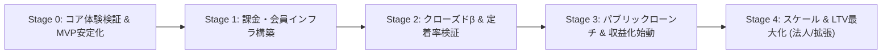

# ShadowLog 収益化・事業推進ロードマップ

**作成日**: 2026年9月24日  
**責任者**: プロジェクト統括担当 (Antigravity)  
**対象プロダクト**: ShadowLog (AIシャドーイング・スピーキング習熟Webサービス)

---

## 1. エグゼクティブ・サマリー

ShadowLogは、既存の「人手による高額シャドーイング（シャドテン: 月額21,780円）」と「フリートークAI英会話（Speak等）」の間に存在する、**「安価に・即時フィードバックで・実践的な英語発話を鍛えたいビジネスパーソン」**の巨大な空白地帯をターゲットにしたSaaSです。

### 収益モデル骨子
- **無料体験 (Layer 1: ゲスト5回 / Layer 2: 会員登録で+15回 / Pro味見2回)**: 登録ハードルを最小化しバイラルを狙う。
- **ベースプラン (Base)**: **月額 500 円**（年払 4,800 円）
  - 短文シャドーイング、カルテ、**1日20〜30回**（AI原価約193〜289円、粗利率 ~40〜58%）
- **プロプラン (Pro - 主力)**: **月額 1,480 円**（年払 12,800 円）
  - 長文スピーチモード（60〜90語）、業界別専門英文、WPM話速解析、**練習回数 完全無制限**（AI原価約386〜482円、粗利率 ~64〜70%）
- **月間固定費（運営インフラ）**: **月額 1,650 円（税込）**
  - GMOオフィスサポート（月1転送/法人登記・特商法表記対応）
  - ★ **損益分岐点: ベースプラン会員「わずか 6 名（Proなら 2 名）」で固定費完全回収・営業黒字化**

---

## 2. ターゲット候補別の特性比較 & 業界展開戦略

| 評価軸 | ① IT・メーカー（技術職・営業） | ② 接客・サービス（ホテル・飲食等） | ③ 医療系（医師・看護師） |
|:---|:---|:---|:---|
| **市場規模（母数）** | **特大**（国内最大の英語学習セグメント） | **大**（インバウンド増加で需要急拡大） | **小〜中**（ニッチだが資格保持者は安定的） |
| **個人課金意欲** | **高**（昇進・TOEIC・海外出張に直結） | **低〜中**（可処分所得が低め、短文暗記を求めがち） | **極めて高**（月数千円〜数万円の専門課金に慣れている） |
| **主なペイン** | 「Web会議の早口な英語が聞き取れない」「TOEICのリスニングが頭打ち」 | 「早口なお客の要望を聞き取れずトラブルになる」 | 「問診・トリアージの聞き取り」「国際学会での質疑応答」 |
| **コンテンツ開発難易度** | **中**（ビジネス会話・汎用ニュース・TOEIC形式で成立） | **中**（業種別フレーズや自然なクレーム会話の作成） | **極高**（専門医学用語・症例・専門家による監修が必須） |
| **マネタイズ適性** | **個人B2Cサブスク（月額1,500〜3,000円帯）** | **B2B / 研修導入（個人向けは低単価・広告が中心）** | **高単価B2C / 専門職サブスク（月額3,000円〜や高額買い切り）** |
| **総合おすすめ度** | **S (本命)** | **B (個人向けは難度高)** | **A- (特化型ならブルーオーシャン)** |

### 開発・リリースのロードマップ（業界展開フェーズ & 1ヶ月置きアップデート計画）
1. **フェーズ1（初期ローンチ / 現行）**: **IT・メーカー（ビジネス一般）に集中**
   - 最も母数が多く、TOEICリスニング対策や「英語会議の聞き取り」需要に特化。汎用ビジネス・テック系音源で立ち上げ。
2. **アップデート v1.1（ローンチ1ヶ月後）**: **「接客・サービス（Hospitality）」拡充**
   - ホテル・飲食・インバウンド接客・クレーム対応フレーズの追加。
3. **アップデート v1.2（ローンチ2ヶ月後）**: **「日常雑談・街中会話（Casual & Town）」拡充**
   - 友人同士のフリートーク、カフェ注文、買い物、旅行トラブル会話の追加。
4. **アップデート v1.3（ローンチ3ヶ月後 / フェーズ2）**: **「医療・特定専門領域（Medical & Specialist）」高単価拡張**
   - 問診・トリアージ・国際学会質疑応答など、専門用語・症例に特化した高単価プレミアムカテゴリの解放。

---

## 3. ステージ別ロードマップ (Stage 0 〜 4)

```mermaid
flowchart LR
    S0["Stage 0: コア体験検証 & MVP安定化"] --> S1["Stage 1: 課金・会員インフラ構築"]
    S1 --> S2["Stage 2: クローズドβ & 定着率検証"]
    S2 --> S3["Stage 3: パブリックローンチ & 収益化始動"]
    S3 --> S4["Stage 4: スケール & LTV最大化 (法人/拡張)"]
```

---

### 【Stage 0】コア体験検証 & MVP安定化 (Now)
**ゴール**: ユーザーが「毎日続けたくなる」核となるUXと音響・AIの安定稼働を保証する。

- [ ] **音声認識・レイテンシの極小化**: Whisper呼び出しのレスポンス改善（録音完了から採点まで2秒以内を目標）
- [ ] **UI/UXのマイクロインタラクション**: 発話時の音量ビジュアライザー、スコア表示時のアニメーション強化
- [ ] **エッジケース耐性強化**: マイク不許可、雑音環境、無音送信時の親切なガイダンスUI
- [ ] **ローカル保存 & Supabase同期の整合性**: ゲスト状態での練習記録がログイン時にシームレスに引き継がれる仕組み
- [ ] **利用規約・プライバシーポリシーの整備**: 音声データ取り扱いポリシー（OpenAIの学習に使われない規約の明記）

---

### 【Stage 1】課金・会員インフラ構築 (Week 1〜3)
**ゴール**: 1円でも課金できる安全かつ自動化されたペイメント基盤を完成させる。

- [ ] **Stripe Checkout & Billing 統合**:
  - Subscription（月額/年額）および顧客ポータル（解約・カード変更）の実装
  - Stripe Webhook（`invoice.paid`, `customer.subscription.deleted` 等）でのSupabaseプラン更新
- [ ] **プラン別アクセス制御 (Feature Flag / Rate Limiting)**:
  - 1日の練習回数カウント（Upstash Redis or Supabase RPC）
  - Pro限定機能（長文スピーチモード、業界別プロンプト切り替え）のガード
- [ ] **課金訴求モーダル (Paywall UI)**:
  - 無料回数終了時、およびPro機能クリック時の魅力的なアップセルモーダル
- [ ] **決済テスト & サンドボックス検証**: テストカードでの購入・アップグレード・ダウングレード・キャンセル検証

---

### 【Stage 2】クローズドβ & 定着率検証 (Week 4〜5)
**ゴール**: 初期テスター30〜50名によるフィードバック回収と、Day 7 継続率 40% 以上の達成。

- [ ] **初期テスター募集**:
  - X (Twitter)、開発コミュニティ、英語学習者コミュニティでの限定募集（招待制）
- [ ] **アナリティクス & 行動トラッキング導入**:
  - PostHog / Google Analytics 4 の導入（どの機能で離脱しているか、WPMがどう伸びているかの追跡）
- [ ] **定着施策（習慣化ループ）の実装**:
  - ストリーク（連続日数）途切れ防止のブラウザ通知・リマインドメール（Resend / SendGrid）
  - SNSシェア用OGP・スコアカード画像自動生成（Xでの「#今日のシャドーイング」拡散）
- [ ] **ユーザーヒアリング**: 有料でも使い続けたいか、月額1,480円への納得感の定性調査
- [ ] **【広報・CRM連携】新着お知らせポップアップ＆吸い込み通知アニメーション機能**:
  - `src/data/announcements.json` での配信定義（カバー画像スライド/タグ表示）
  - 右上✕ / 「確認した (既読)」 / 「⏱️ あとで読む」のマルチアクション
  - 「あとで読む」選択時：画面左下の設定アイコンにシュッと吸い込まれる＋設定アイコンがピクッと跳ねる（bounce）エフェクト
  - 設定アイコンに赤い未読ドット（●）点灯 ＆ 設定画面内でのアーカイブ閲覧・既読化

---

### 【Stage 3】パブリックローンチ & 収益化始動 (Week 6〜8 / 3ヶ月後到達目標)
**ゴール**: 有料会員 50名（ベーシック45名 / Pro 5名、MRR ¥29,900/月、確実な営業黒字化の確立）。

- [ ] **Product Hunt / Zenn / Note ローンチ**:
  - 開発ストーリー記事「シャドテンが高すぎて月1,480円のAI版を個人開発した話」の公開
- [ ] **SEO & コンテンツマーケティング**:
  - 「英語シャドーイング おすすめ」「シャドテン 違い」「WPM 測り方」などのキーワードを狙ったLP / ブログ記事
- [ ] **インフルエンサー / 英語系YouTuberギフティング**:
  - 英語系マイクロインフルエンサーにProアカウントを無償提供し、実演レビューを依頼
- [ ] **初回限定キャンペーン**: 初月半額または年間プラン早期割引オファー

---

### 【Stage 4】スケール & LTV最大化 (Month 3以降)
**ゴール**: 有料会員 500〜1,000名（月商40〜88万円 / 年間粗利300〜540万円）、法人展開の足がかり。

- [ ] **ネイティブアプリ化 (PWA強化 or Flutter / React Native)**:
  - プッシュ通知による継続率の底上げ
- [ ] **B2B / 法人プランの検討**:
  - 企業のグローバル研修向け管理画面（社員の発話量・WPM推移を人事が見られるダッシュボード）
- [ ] **AIパーソナライズの深化**:
  - ユーザーの弱点音素（L/R, Th, 連結音など）を自動抽出し、専用の特訓文を生成するアダプティブラーニング

---

## 3. 重要KPI設定

| 指標 | Stage 1 (構築) | Stage 2 (β) | Stage 3 (ローンチ 3ヶ月目標) | Stage 4 (拡大) |
|---|---|---|---|---|
| **累計登録者** | - | 50名 | 250〜500名 | 2,500〜5,000名 |
| **有料会員数** | - | 5名 (事前予約) | **50名 (Basic 45 / Pro 5)** | 500〜1,000名 |
| **月間売上 (MRR)** | 0円 | 0円 | **¥29,900 /月** | 約40万〜88万円 |
| **翌週継続率 (Day 7 Retention)** | - | 40%以上 | 45%以上 | 50%以上 |
| **平均練習回数/人/日** | - | 5回以上 | 8回以上 | 10回以上 |
