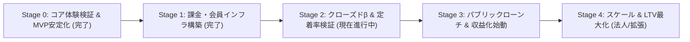

# ShadowLog 収益化・事業推進ロードマップ

**作成日**: 2026年9月24日  
**最終更新日**: 2026年9月30日（4大ジャンル集約・300文問題バンク・使い放題・最新収支反映）  
**責任者**: プロジェクト統括担当 (Antigravity)  
**対象プロダクト**: ShadowLog (AIシャドーイング・スピーキング習熟Webサービス)

---

## 1. エグゼクティブ・サマリー

ShadowLogは、既存の「人手による高額シャドーイング（シャドテン: 月額21,780円）」と「フリートークAI英会話（Speak等）」の間に存在する、**「安価に・即時フィードバックで・実践的な英語発話を鍛えたいビジネスパーソン」**の巨大な空白地帯をターゲットにしたSaaSです。

### 収益モデル ＆ 原価構造骨子（2026/09/30 最新版）
- **無料体験 (Layer 1: ゲスト5回 / Layer 2: 無料会員登録で+15回 [計20回] / Pro味見2回)**:
  - さらに `/waitlist` LPでの1問インタラクティブデモ＆14日間無料クーポン配布、および2026/10/20迄の登録者に10/30までVIP（Pro無制限）自動付与キャンペーンを実施中。
- **ベースプラン (Base)**: **月額 500 円**（手取 482 円）
  - 短文シャドーイング（4大ジャンル）、チャンク(`/`)表示、カルテ、**1日練習上限なし（使い放題）**
  - 採算限界: バンク蓄積期（`@0.322円/回`）で **1日約50回**、問題バンク定常期（`@0.097円/回`）で **1日約165回**。
- **プロプラン (Pro - 主力)**: **月額 1,480 円**（手取 1,427 円）
  - 長文スピーチモード（60〜90語）、4大実務ジャンル専門英文、WPM話速解析、**完全無制限（使い放題）**
  - 採算限界: バンク蓄積期で **1日約147回**、問題バンク定常期で **1日約490回**。
- **月間固定費（運営インフラ）**: **月額 1,650 円（税込）**
  - GMOオフィスサポート（月1転送/法人登記・特商法表記対応。Vercel/Supabase/Resendは無料枠0円）
  - 問題バンク週10%自動ローテーション固定費（定常期）: **月額 約 331 円**（週360文・月1,440文入替）
  - ★ **損益分岐点: ベースプラン会員「わずか 5〜6 名（Proなら 2 名）」で全固定費完全回収・営業黒字化**
- **3ヶ月後到達目標（有料会員 50名：Basic 45名 ＋ Pro 5名）**:
  - **月間総売上 (MRR)**: **¥29,900 / 月**（Stripe手数料控除後純売上: **¥28,824 / 月**）
  - **月間営業利益（GMO固定費控除後）**:
    - 📘 バンク蓄積期（`@0.322円/回`）: **+¥16,532 〜 +¥17,514 / 月（営業利益率 55.3%〜58.6%）**
    - 🏦 問題バンク定常運用期（`@0.097円/回 + 月331円`）: **+¥23,642 〜 +¥23,933 / 月（営業利益率 79.1%〜80.0%！）**

---

## 2. 4大ジャンル集約 ＆ 3,600文問題バンク戦略（2026/09/30 刷新）

従来の6ジャンルから、ユーザー需要が高く学習効果の大きい **4大ジャンル** に集約し、各ジャンル×3レベル（初級・中級・上級）＝ **12スロット × 各300文 ＝ 合計3,600文** の問題バンク（`sentence_bank`）を構築・運用します。

| ジャンルID | ジャンル名称 | 対象・主なシチュエーション | バンク規模 |
|:---|:---|:---|:---|
| **1. `Tech`** | **💻 IT・テック** | 開発会議、システム障害報告、プロダクト仕様議論、エンジニア・PM実務 | 3レベル × 300文 (900文) |
| **2. `Business`** | **💼 ビジネス総合** | 交渉、進捗報告、決算・投資・財務（旧Finance統合）、エグゼクティブ会議 | 3レベル × 300文 (900文) |
| **3. `Marketing`** | **📣 マーケ・企画** | キャンペーン戦略、顧客インサイト分析、ブランディング、プレゼン提案 | 3レベル × 300文 (900文) |
| **4. `Daily`** | **☕ 日常・雑談** | アイスブレイク、海外出張・旅行、カフェ注文、スモールトーク（旧Medical廃止） | 3レベル × 300文 (900文) |

- **週1回 10% 自動ローテーション (`/api/sentence-bank/rotate`)**:
  - 各スロットが300文に達した後はDBから0.1秒・APIコスト0円で即時配信。
  - 毎週1回、各スロットの利用回数上位10%（30文×12枠＝週360文）を新規生成文＋TTS音声と自動入れ替えし、月額わずか約331円の固定費で常に新鮮な教材プールを維持。

---

## 3. ステージ別ロードマップ (Stage 0 〜 4)

```mermaid
flowchart LR
    S0["Stage 0: コア体験検証 & MVP安定化 (完了)"] --> S1["Stage 1: 課金・会員インフラ構築 (完了)"]
    S1 --> S2["Stage 2: クローズドβ & 定着率検証 (現在進行中)"]
    S2 --> S3["Stage 3: パブリックローンチ & 収益化始動"]
    S3 --> S4["Stage 4: スケール & LTV最大化 (法人/拡張)"]
```

### 【Stage 0】コア体験検証 & MVP安定化（✅ 100% 完了）
- [x] Whisper音声認識レスポンス高速化・Diff差分エンジン＆WPM計算精度テスト（Vitest 100% Pass）
- [x] 無音録音・マイク拒否・Bluetooth/AirPods自動検知フォールバックUI
- [x] ゲスト体験でのカルテ保存 ＆ Googleワンクリックログイン時の自動引き継ぎ
- [x] 法務3画面（`/terms`, `/privacy`, `/tokushoho`）実装

### 【Stage 1】課金・会員インフラ構築（✅ 100% 完了）
- [x] Stripeアカウント開設・Checkout決済連携（月額500円 Base / 月額1,480円 Pro）
- [x] 3段階チケット制（ゲスト5回 ＋ 無料登録15回 ＋ Pro味見2回）＆ 有料プラン1日上限撤廃（使い放題）
- [x] VIPホワイトリスト ＆ クローズドβ期間限定VIP自動付与（10/20迄登録 ➔ 10/30迄VIP）
- [x] 顧客管理画面（`/admin/customers`）での利用回数・想定原価・損益分岐リスク自動監視

### 【Stage 2】クローズドβ & 定着率検証（🔥 現在進行中）
- [x] Threads初期投稿公開 ＆ クローズドβテスター第1陣（5名）招待・稼働開始（9/29〜）
- [x] サイレントアクセスロガー（`daily_analytics` DB永続化）＆ 統括ダッシュボード統合
- [x] 弱点単語組み込み生成アルゴリズム ＆ オフライン閲覧キャッシュ同期
- [x] お問い合わせ・不具合報告フォーム（Resend通知・自動返信・スクショ添付）
- [x] 新着お知らせポップアップ ＆ 「あとで読む」設定アイコン吸い込み通知アニメーション
- [x] 【FB-016】練習セッションWPM自動算出・保存 ＆ ダッシュボード推移グラフ完全同期
- [x] 【FB-017】先行登録LP（`/waitlist`）公開（1問デモ体験・14日間無料クーポン自動送信）
- [x] 【FB-018/019】結果画面下部オレンジ「次のフレーズへ」バー ＆ チャンク(`/`)区切り表示 ＆ 管理者プレビュー
- [x] 【FB-020】バックグラウンド1問先読み（`0.0秒`遷移）＆ 4大ジャンル300文バンク（週10%自動入替）
- [x] 【FB-021】録音開始時の模範音声自動停止（マイク回り込み防止）＆ Listen-then-Speak導線改善
- [ ] 習慣化リマインド通知（ストリーク途切れ防止のメール/Web通知）
- [ ] SNSシェア用OGP画像自動生成機能（「#今日のシャドーイング」拡散用）
- [ ] βテスター（30〜50名拡大）へのヒアリング・価格納得感の検証

### 【Stage 3】パブリックローンチ & 収益化始動（3ヶ月後到達目標）
- [ ] Zenn / Note 開発ストーリー記事公開・Product Hunt ローンチ
- [ ] SEO比較LP公開・英語系マイクロインフルエンサーPro体験ギフティング
- [ ] **有料会員50名（Basic 45名 / Pro 5名、MRR ¥29,900、定常期月間営業利益 +¥23,933）の達成**

### 【Stage 4】スケール & LTV最大化
- [ ] 有料会員200〜1,000名（月商12万〜88万円）、PWAプッシュ通知強化、B2B法人研修ダッシュボード展開

---

## 4. 重要KPI設定

| 指標 | Stage 1 (完了) | Stage 2 (現在: β検証) | Stage 3 (3ヶ月後目標) | Stage 4 (拡大) |
|---|---|---|---|---|
| **累計登録者 / テスター** | - | 5名稼働中 ➔ 30〜50名 | 250〜500名 | 2,500〜5,000名 |
| **有料会員数** | - | クローズドβ VIP期間 | **50名 (Basic 45 / Pro 5)** | 200〜1,000名 |
| **月間売上 (MRR)** | 0円 | 0円 | **¥29,900 /月** | 約12万〜88万円 |
| **月間営業利益 (GMO控除後)** | - | - | **+¥23,933 /月 (定常期80%)** | 約9.9万〜70万円 |
| **翌週継続率 (Day 7 Retention)** | - | 40%以上 | 45%以上 | 50%以上 |
