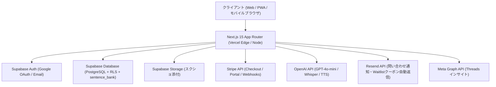

# ShadowLog (シャドーログ) サービス ＆ システム基本仕様設計書

**初版策定日**: 2026年9月27日  
**最終更新日**: 2026年10月6日（3単語カスタム例文生成・マイ単語登録・プラン別JST日次制限反映）  
**プロダクト責任者**: プロジェクト統括担当 (Antigravity)  
**対象リポジトリ**: `ic1koala/Shadowlog`  

---

## 1. プロダクト概要 & バリュープロポジション

### ① サービスビジョン
**「英語を話したいすべての人が、挫折せず、圧倒的低価格で実践発話力を鍛えられるAIシャドーイング習慣化SaaS」**

### ② 市場のペインと差別化
- **既存の課題**:
  - 人手による高額シャドーイング添削（シャドテン: 月額21,780円）は高価格すぎて大半のビジネスパーソンが継続できない。
  - フリートーク型AI英会話（Speak等）は、自分の発音のどこが落ちているか（脱落音・連結音）が可視化されにくい。
- **ShadowLogの解決策（2026/10/06 最新仕様）**:
  - **即時Diff判定 ＆ 太字青色チャンク（`/`）全ユーザー標準表示**: 発話音声をAI文字起こしし、脱落単語・誤読単語を赤字ハイライト（凡例は書き起こし直下に配置）。さらにレイアウトズレゼロの太字青色スラッシュ（`/`）で意味の塊（チャンク）を全ユーザー向けに標準可視化。
  - **3単語マイカスタム例文生成 ＆ 難易度連動1〜2文構成（FB-035）**: 「自分が今仕事や日常で使いたい3つの単語」を設定画面に登録し、練習画面からワンタップで即時オリジナル例文と音声を動的生成。初級（10〜14語）、中級（15〜20語）、上級（21〜28語）と無理のない自然な文脈構成で実践発話練習が可能（Base: 1日3回 / Pro: 1日10回）。
  - **再生速度連動「動的WPM」リアルタイム表示**: お手本音声の再生速度（0.6x / 1.0x / 1.2x）ごとに、実測音声長（`duration`）と単語数から算出した実効WPMをリアルタイムでカプセルUIに併記表示。
  - **バックグラウンド1問先読み（Prefetch 0.0秒遷移）**: 1問目を練習中に裏側で次の問題と音声を先読みキャッシュし、画面下部オレンジ色の「次のフレーズへ」バーから待ち時間 `0.0秒` で連続練習可能。
  - **4大ジャンル×300文問題バンク（計3,600文）＆ 週10%季節・トレンド自動ローテーション**: 利用頻度の高い4ジャンル（`Tech`, `Business` [旧Finance統合], `Marketing`, `Daily` [旧Medical廃止]）×3レベル＝12スロットに各300文を蓄積。さらに日常会話（Daily）での平易な口語ペルソナ分岐、季節感のオプショナル化（無理な紐付け・ポエム調禁止）、およびバズワード排除（FB-038）により、日常で本当に使われる自然な発話フレーズを徹底生成し、0.1秒配信とAPI原価70%超削減を両立。
  - **Listen-then-Speak 音響制御 ＆ 録音・採点ボタン最適化**: 録音開始時に再生中の模範音声を自動停止し、スピーカー音のマイク回り込み（誤採点）を完全防止。判定完了後は「判定する」をグレーアウト完了状態、「録り直す」を青色ハイライトに切り替えて直感的な反復練習を誘導。
  - **圧倒的低価格 & 使い放題**: 月額500円（Base）/ 月額1,480円（Pro）で1日回数上限なしの練習環境を提供。

---

## 2. 料金プラン ＆ チケット・利用制限体系

| プラン名 | 月額料金 (税込) | 短文シャドーイング | 長文スピーチ (60〜90語) | 弱点単語帳 & カルテ | 3単語カスタム生成 | 1日練習上限 | 損益分岐限界 (蓄積期 ➔ バンク定常期) |
|:---|:---:|:---:|:---:|:---:|:---:|:---:|:---:|
| **無料体験 (ゲスト)** | 0円 | 累計 5回 | ✕ | ✕ (端末のみ) | 累計 2回 | 累計5回で終了 | N/A |
| **無料会員 (Free)** | 0円 | 累計 20回 (+15回) | 2回 (味見枠) | ◯ (クラウド同期) | 累計 2回 | 累計20回で終了 | N/A |
| **ベースプラン (Base)** | **500 円** | **無制限 (使い放題)** | ✕ | ◯ | **1日 3回 (JST)** | **上限なし** | **1日約50回 ➔ 定常期 約165回** |
| **Proプラン (Pro)** | **1,480 円** | **無制限 (使い放題)** | **無制限 (使い放題)** | ◯ (4大ジャンル可) | **1日 10回 (JST)** | **上限なし** | **1日約147回 ➔ 定常期 約490回** |

> 📌 **仕様確定事項**:
> - **1日利用上限の撤廃**: 有料プランにおける「1日20〜30回まで」等の上限設定は完全撤廃。使い放題として提供しつつ、管理者側（`/admin/customers`）で各ユーザーの利用頻度と原価リスクを保守基準（50回/147回）で自動モニタリング。
> - **クローズドβ期間限定VIPキャンペーン**: 2026年10月20日までに無料会員登録したユーザーは、**2026年10月30日まで自動的にVIP（Proプラン相当・回数無制限）** として利用可能（`vip-checker.ts` にて自動判定）。

---

## 3. AI・音響パイプライン ＆ 原価構造（2フェーズ試算）

### ① 1回あたりのAI原価内訳
1. **フェーズA：バンク蓄積期・保守上限モード（各スロット300文未満時）**:
   - **Whisper-1** (音声文字起こし): 録音 約10秒 (\$0.006/分) ➔ **約 0.149 円**
   - **TTS-1** (模範音声生成・リトライ時再利用): 1文 約133文字 ➔ **約 0.150 円**
   - **GPT-4o-mini** (動的例文生成 ＆ コーチング): 弱点単語上位5語注入 ➔ **約 0.024 円**
   - **蓄積期 合計実質原価**: **約 0.322 円 / 練習** (\$0.00215 @ \$1=150円)
2. **フェーズB：問題バンク定常運用モード（各スロット300文到達後＋週10%入替）★本命**:
   - **出題・TTS模範音声・先読み（Prefetch）原価**: `sentence_bank` から0.1秒配信のため **完全 0 円**。
   - **練習ごとの変動原価**: Whisper音声認識 ＋ GPT-4o-miniコーチ評価のみ ➔ **約 0.097 円（約0.10円）〜 0.165 円 / 練習**（従来比 **約70〜80%圧縮**）。
   - **週次10%自動ローテーション固定原価（`/api/sentence-bank/rotate`）**:
     - 各スロット30文×12スロット＝週360文（月間1,440文）を利用回数上位から入れ替え。
     - `1,440文 × 約0.23円` ＝ **月額 約 331 円 / 月（会員数に依存しない完全固定費）**。

### ② 固定費 ＆ 3ヶ月後到達目標（50名：Basic 45名 / Pro 5名）収支
- **月間総売上 (MRR)**: Basic `45名 × ¥500 = ¥22,500` ＋ Pro `5名 × ¥1,480 = ¥7,400` ＝ **¥29,900 / 月**
- **Stripe決済手数料 (3.6%)**: **-¥1,076 / 月** ➔ **手取純売上: ¥28,824 / 月**
- **インフラ固定費**: GMOオフィスサポート（月1転送プラン・法人登記/特商法可）= **-¥1,650 / 月**（Vercel, Supabase, Resend, GitHub は無料枠 **¥0**）
- **固定費回収分岐点**:
  - ベースプラン会員 **わずか 5〜6 名**（または Pro会員 **わずか 2 名**）で全固定費完全ペイ。
- **50名到達時の月間最終営業利益**:
  - **📘 フェーズA（バンク蓄積期 `@0.322円/回`）**:
    - 月間AI原価: `-¥9,660`（30,000回時）〜 `-¥10,641`（33,000回時）
    - GMO代控除後 営業利益: 🟢 **+¥16,532 〜 +¥17,514 / 月（営業利益率 55.3%〜58.6%）**
  - **🏦 フェーズB（問題バンク定常期 `@0.097円/回 + 入替¥331/月`）**:
    - 月間AI総原価: `-¥3,241`（変動¥2,910 + 入替¥331）〜 `-¥3,532`（33,000回時）
    - GMO代控除後 営業利益: 🟢 **+¥23,642 〜 +¥23,933 / 月（営業利益率 79.1%〜80.0%！）**

### ③ API限界・レートリミット（OpenAI Tier 1）
- **Whisper-1 (STT)**: 上限 50 RPM ➔ 50名利用時平均 1.53〜2.29 RPM（**負荷率 3.0%〜4.6%、安全率 22〜33倍**）
- **TTS-1 (音声)**: 上限 50 RPM ➔ バンク定常期はリアルタイム呼び出し **0.0 RPM**（週1回バッチ生成のみ）
- **GPT-4o-mini**: 上限 500 RPM / 20万 TPM ➔ 平均 1.53 RPM（**負荷率 0.3%以下、安全率 300倍以上**）

---

## 4. システムアーキテクチャ & 技術スタック

### ① フロントエンド
- **フレームワーク**: Next.js 15 (App Router), React 18, TypeScript
- **UI / UX**:
  - **太字青色チャンクスラッシュ（`/`）全ユーザー標準表示**: 改行位置や単語間隔を1pxも変えないゼロ・レイアウトシフト設計で、全ユーザーに標準ONで表示（`b1d50fe`）。
  - **再生速度別「動的WPM」リアルタイム表示**: 0.6x / 1.0x / 1.2x の各速度ボタンに実測WPM（音声メタデータの `duration` または 150 WPMフォールバック）をリアルタイム算出・表示（`6f25ffa`）。
  - **スライディングカラオケハイライト ＆ Diff凡例最適化**: 再生中テキストの滑らかなカラオケハイライトと、文字起こし結果直下へのDiff凡例配置（`4e2f95d`）。
  - **採点結果画面のフローティング「次のフレーズへ」バー ＆ ボタン状態制御**: 下部固定オレンジ色バー（スコアバッジ付）による即座の次問遷移。採点完了後は「判定する」ボタンをグレーアウトし、「録り直す」ボタンを青色ハイライトして誤操作を防止（`da3abeb`, `b1d50fe`）。
  - **バックグラウンド1問先読み（Prefetch 0.0秒遷移）**: `prefetchedItemRef` により1問目練習中に次問テキスト・TTS音声を裏で取得し、待ち時間 `0.0秒` で次問へ切り替え（`2605ee2`）。
  - **2ボタン分割録音モード全ユーザー開放（リピーティング青 ／ シャドーイング紫）＆ Android音量ブースト**:
    - 「🗣️ リピーティング録音（お手本停止・自習）」と「🎧 シャドーイング録音（イヤホンを装着し、しっかりと発声）」の2ボタン分割を全ユーザーへ正式開放。
    - シャドーイング録音時は WebRTC DSP（`echoCancellation / noiseSuppression / autoGainControl`）を完全無効化してダッキング（音量低下）を防止し、Androidでは本体マイク入力優先＋Web Audio API（`GainNode` 2.2x〜2.6x増幅＋リミッター）による音量ブーストを実装。
  - **習慣化Webプッシュ通知リマインド（メール通知なし・当日練習済み自動スキップ）**:
    - 設定画面（`/settings`）の「🔔 リマインド」にて、希望時刻のWebプッシュ通知をON/OFF設定可能（Service Worker `/sw.js` 連携・即時テスト通知ボタン付）。
    - iPhone Safari（未PWA）閲覧時には3ステップの「📲 ホーム画面に追加」案内カードを自動表示し、その日に1回でも練習済みの場合は通知を自動スキップするスマート判定（`FB-033`, `8d377c7`）。
  - **ダッシュボードWPM推移チャート（120 WPM目安ライン動的スケーリング）**: ユーザーの最大WPMに応じて「120 WPM目安ライン」のY座標を動的に計算・描画（`950c2d9`）。
  - **設定画面（`/settings`）の整理・アコーディオン化**: 上部クイックナビ、業種・難易度設定のアコーディオン折りたたみ、未読お知らせ時の「未読あり」バッジ表示（`e03fa66`, `1f59808`）。
  - **3単語マイ単語カスタム例文生成（設定画面での登録・候補チップ提示 ＆ 練習画面ワンタップ発火）**:
    - 設定画面（`/settings#section-custom-words`）にて学びたい3単語・キーワード（英単語・日本語両対応、空欄可）を事前登録。
    - 4大ジャンル別おすすめ重要語彙チップや、未克服の「苦手単語カルテ」からのワンタップ選択チップにより入力の手間を大幅削減。
    - 練習画面（`/practice`）の「条件を変更する」横に `✨ マイ単語で生成 (本日残り X/3)`（Pro: `X/10`、無料: `残り X/2`）ボタンを配置。未登録時は `✨ カスタム設定` 導線を表示。
    - 登録単語を1文に無理に詰め込まず、選択難易度の語数（初級: 10〜14語、中級: 15〜20語、上級: 21〜28語）に合わせて自然な1〜2文構成で動的生成。生成フレーズ上部には `✨ マイ単語適用中: [単語1, 単語2, 単語3]` バッジと単語変更リンクを表示（`FB-035`, `d313e7e`）。
  - **管理者限定プレビューモード**: `shadowlog.app@gmail.com` 専用 `🧪 テストボタンモード` トグル（新機能の段階的検証基盤、`5c294c4`, `bca75fc`, `955a355`）。

### ② バックエンド & データベース (Supabase)
- **リアルタイム自動保存 ＆ 未同期セッション自動レスキュー同期**:
  - 採点完了時にローカル保存と同時に Supabase `practice_sessions` へ即時保存。さらにログイン時・画面起動時にローカルのみの未同期セッションを検出し、WPMデータを含めてクラウドへ自動レスキュー同期（`23d2658`, `d2c0cbf`）。
- **データベース設計**:
  - `sentence_bank`: id, genre (`Tech`/`Business`/`Marketing`/`Daily`), level (`beginner`/`intermediate`/`advanced`), mode (`sentence`), text_en, text_jp, phonetic, tip, chunks, audio_base64, use_count, created_at（最大300文/スロット×12＝3,600文、週1回10%ローテーション `/api/sentence-bank/rotate`、季節・四半期トレンド自動注入 `f9377a7`）
  - `profiles`: ユーザーID (UUID, auth.users連携), email, plan (free/base/pro), nickname, stripe_customer_id
  - `user_tickets`: tickets_used, pro_trials_used, daily_practice_count, last_practice_date
  - `practice_sessions`: id, user_id, text_en, text_jp, transcribed_text, accuracy_score, wpm, diff_result, coach_feedback, created_at
  - `weak_words`: user_id, word, fail_count, is_mastered, last_practiced_at
  - `push_subscriptions`: id, user_id, endpoint, p256dh, auth, reminder_time, timezone, enabled, last_notified_date（Webプッシュ通知リマインド用、`8d377c7`）
  - `feedback_tickets`: id, category, email, content, screenshot_url, environment_info, status, created_at
  - `daily_analytics`: date, pv, uu, user_types, path_counts（日次アクセス永続保存）

---

## 5. 管理・運用・マーケティング体制

### ① 顧客管理画面 (`/admin/customers`)
- **管理者権限の厳格化**: 管理者アクセス権を `shadowlog.app@gmail.com` の1アカウントのみに厳格化（`bca75fc`）。
- **採算リスク自動計算 ＆ プラン別内訳**: 全ユーザーの「本日の練習回数」「1日平均練習回数」「月間想定AI原価」「採算リスク（🟢 安全 / 🟡 注意 / 🔴 警戒）」および Pro / Basic プラン契約数の個別内訳をリアルタイム集計・CSV出力対応（`7f074af`）。
- **メンバー別「日次利用回数折れ線グラフ」モーダル**: 各顧客の利用回数ボタンをタップすると、日別の練習回数推移を折れ線グラフ＋サマリー（合計・1日平均・最高記録）で可視化するモーダルを表示（`9e7649f`）。
- **モバイル向けカード/テーブル表示切替 ＆ コンプライアンス監査ログ統合**: スマホ閲覧時に見やすいカードビュー切替と、コンプライアンス監査ログタブを `/admin/customers` 内に一元化（`0a73300`, `7f074af`）。

### ② ウェイトリストLP (`/waitlist`) & クローズドβ集客
- ブラウザ上でその場で1問発音採点を試せるインタラクティブUIデモを搭載。
- メールアドレス登録時に Resend API 経由で **「14日間無料体験クーポンコード」** を即時自動返信（`2f96abf`）。

### ③ 統括ダッシュボード (`management/checklist.html` / `public/management.html`)
- 進捗＆タスク管理、Dailyアクセス解析、Threads投稿インサイト、および本「基本仕様設計書」タブを一元管理。

---

## 6. 仕様更新・管理ルール

> ⚠️ **恒久管理ルール**:
> 今後、価格体系、回数制限、AIパイプライン、データベース構造、UI仕様に変更があった場合は、**必ず本設計書（`management/SYSTEM_SPECIFICATION.md`）および統括ダッシュボード（`management.html` / `checklist.html`）の「基本仕様設計書」タブを即座に更新すること**。
