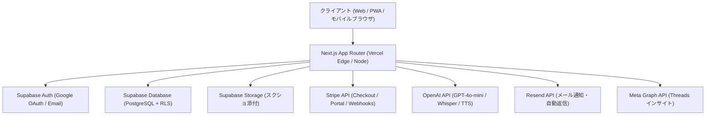

# ShadowLog (シャドーログ) サービス ＆ システム基本仕様設計書

**初版策定日**: 2026年9月27日  
**最終更新日**: 2026年9月27日  
**プロダクト責任者**: プロジェクト統括担当 (Antigravity)  
**対象リポジトリ**: `ic1koala/Shadowlog`  

---

## 1. プロダクト概要 & バリュープロポジション

### ① サービスビジョン
**「英語を話したいすべての人が、挫折せず、圧倒的低価格で実践発話力を鍛えられるAIシャドーイング習慣化SaaS」**

### ② 市場のペインと差別化
- **既存の課題**:
  - 人手による高額シャドーイング添削（シャドテン: 月額21,780円）は高価格すぎて大半のビジネスパーソンが継続できない。
  - フリートーク型AI英会話（Speak等）は、自分の発音のどこが落ちているか（脱落音・連結音）が可視化されにくい。
- **ShadowLogの解決策**:
  - **即時Diff判定**: 発話音声をAI文字起こしし、脱落単語・誤読単語をハイライト表示。
  - **話速（WPM）解析**: ネイティブ模範音声に対する自身の追従速度をスコア化。
  - **弱点克服パーソナライズ**: 苦手単語（Weak Words）を自動抽出し、次回以降の生成文に自動注入。
  - **圧倒的低価格 & 使い放題**: 月額500円（Base）/ 月額1,480円（Pro）で回数無制限の練習環境を提供。

---

## 2. 料金プラン ＆ チケット・利用制限体系

| プラン名 | 月額料金 (税込) | 短文シャドーイング | 長文スピーチ (60〜90語) | 弱点単語帳 & カルテ | WPM話速解析 | 1日練習上限 | 損益分岐限界 (採算ライン) |
|:---|:---:|:---:|:---:|:---:|:---:|:---:|:---:|
| **無料体験 (ゲスト)** | 0円 | 累計 5回 | ✕ | ✕ (端末のみ) | ◯ | 累計5回で終了 | N/A |
| **無料会員 (Free)** | 0円 | 累計 20回 (+15回) | 2回 (味見枠) | ◯ (クラウド同期) | ◯ | 累計20回で終了 | N/A |
| **ベースプラン (Base)** | **500 円** | **無制限 (使い放題)** | ✕ | ◯ | ◯ | **上限なし** | **1日約50回 (月1,492回)** |
| **Proプラン (Pro)** | **1,480 円** | **無制限 (使い放題)** | **無制限 (使い放題)** | ◯ (業界別英文可) | ◯ | **上限なし** | **1日約147回 (月4,414回)** |

> 📌 **仕様確定事項（2026/09/27）**:
> オーナー様方針に基づき、**有料プランにおける「1日20〜30回まで」等の上限設定は完全撤廃**。使い放題として提供しつつ、管理者側（`/admin/customers`）で各ユーザーの利用頻度と原価リスクを自動モニタリングする安全構造を採用。

---

## 3. AI・音響パイプライン ＆ 原価構造

### ① 1回あたりのAI原価内訳
- **Whisper-1** (音声文字起こし): 録音 約10秒 ($0.006/分) ➔ **約 0.149 円**
- **TTS-1** (模範音声生成): 1文 約133文字 ($15.00/100万文字) ➔ **約 0.150 円**
  - ※ リトライ時は同一フレーズの音声をメモリキャッシュから再利用するため2回目以降のTTS原価は **0 円**。
- **GPT-4o-mini** (動的例文生成 ＆ コーチング): 約570トークン ➔ **約 0.024 円**
  - ※ ユーザーの弱点単語（Weak Words）上位5語をシステムプロンプトに動的注入。
- **合計実質原価**: **約 0.322 円 / 練習** ($0.00215 @ $1=150円)

### ② 固定費 ＆ 損益分岐点
- **固定費**: GMOオフィスサポート（月1転送プラン・法人登記/特商法可）= **1,650 円 / 月**
- **固定費回収分岐点**:
  - ベースプラン会員 **わずか 6 名**（または Pro会員 **わずか 2 名**）で固定費完全ペイ。
- **3ヶ月後到達目標（50名ポートフォリオ: Basic 45名 / Pro 5名）**:
  - 月間売上: **¥29,900 / 月**
  - Stripe決済手数料 (3.6%): -¥1,076
  - 月間AI原価: -¥10,641 / 月（推奨実効稼働時 33,000回/月）
  - 粗利益: **+¥18,182 / 月（粗利率 60.8%）**
  - GMO代控除後 営業利益: 🟢 **+¥16,532 / 月（営業利益率 55.3%）**
  - （※全員が毎日上限まで利用し尽くす超高負荷時でも、営業利益 **+¥11,211 / 月（利益率 37.5%）** の黒字保証）

### ③ API限界・レートリミット（OpenAI Tier 1）
- **Whisper-1 (STT)**: 上限 50 RPM ➔ 50名利用時平均 1.53〜2.29 RPM（**負荷率 3.0%〜4.6%、安全率 22〜33倍**）
- **TTS-1 (音声)**: 上限 50 RPM ➔ キャッシュ後平均 0.80〜1.20 RPM（**負荷率 1.6%〜2.4%、安全率 40〜62倍**）
- **GPT-4o-mini**: 上限 500 RPM / 20万 TPM ➔ 平均 1.53 RPM / 870 TPM（**負荷率 0.3%、安全率 300倍以上**）

---

## 4. システムアーキテクチャ & 技術スタック

### ① フロントエンド
- **フレームワーク**: Next.js 14+ (App Router), React 18, TypeScript
- **スタイリング**: Tailwind CSS, Lucide React (アイコン), Canvas Confetti (達成演出)
- **音声処理**: Web Audio API (`MediaRecorder`, `AudioContext`), MIMEタイプ自動フォールバック (`audio/webm`, `audio/mp4`)
- **PWA / デバイス対応**: マイク自動権限解放, AirPods / Bluetooth マイク自動検知

### ② バックエンド & データベース (Supabase)
- **データベース設計**:
  - `profiles`: ユーザーID (UUID, auth.users連携), email, plan (free/base/pro), nickname (通称名), stripe_customer_id
  - `user_tickets`: tickets_used, pro_trials_used, daily_practice_count, last_practice_date
  - `practice_sessions`: id, user_id, text_en, text_jp, transcribed_text, accuracy_score, wpm, diff_result, coach_feedback, created_at
  - `weak_words`: user_id, word, fail_count, is_mastered, last_practiced_at
  - `feedback_tickets`: id, category, email, content, screenshot_url, environment_info, status, created_at
- **セキュリティ**:
  - 全テーブルで **Row Level Security (RLS)** を完全有効化（自分のレコードのみ SELECT/INSERT/UPDATE 可能）。
  - 管理者専用APIはサーバーサイドで `shadowlog.app@gmail.com` のAdmin権限を厳格検証。

### ③ 決済基盤 (Stripe)
- **Stripe Checkout**: 顧客向け決済フロー（月額500円 / 月額1,480円）
- **Stripe Customer Portal**: ユーザー自身でのカード変更・プラン変更・解約
- **Webhookハンドラー**: `customer.subscription.created`, `customer.subscription.updated`, `customer.subscription.deleted`, `invoice.payment_succeeded` によるSupabase profiles自動同期

---

## 5. 管理・運用・モニタリング体制

### ① 顧客管理画面 (`/admin/customers`)
- **利用モニタリング**:
  - 全ユーザーの「本日の練習回数（JST基準）」および「1日平均練習回数（活動日数ベース）」を集計。
- **採算リスク・メーター自動計算**:
  - 1練習原価 0.322円を基に、月間想定AI原価を算出。
  - 損益分岐限界（Base: 1日50回、Pro: 1日147回）に対する到達度を判定し、バッジ表示（🟢 安全 / 🟡 注意 / 🔴 警戒）。
- **KPIカード & CSVエクスポート**:
  - 平均利用頻度、最高負荷ユーザー、リスク警戒アカウント数をリアルタイム集計。CSVダウンロード対応。

### ② 統括ダッシュボード (`management/checklist.html` / `public/management.html`)
- **事業進捗管理**: ステージ別タスクリスト（Stage 0〜4）
- **Dailyアクセス解析**: 日別PV/UU推移、訪問者構成（ゲスト/会員比率）、画面別ランキング
- **広報 & CRM**: Threads API連携によるインプレッション・投稿パフォーマンス追跡
- **基本仕様設計書タブ**: 本仕様書のリアルタイム閲覧

### ③ お問い合わせ・フィードバック窓口
- アプリ内設定画面最下部のお問い合わせフォームから、Resend API経由で `shadowlog.app@gmail.com` に即時HTML通知。
- Reply-To設定により、管理者はGmailから直接ユーザー宛にワンクリック返信可能。

---

## 6. 仕様更新・管理ルール

> ⚠️ **恒久管理ルール**:
> 今後、価格体系、回数制限、AIパイプライン、データベース構造、UI仕様に変更があった場合は、**必ず本設計書（`management/SYSTEM_SPECIFICATION.md`）および統括ダッシュボード（`management.html`）の「基本仕様設計書」タブを即座に更新すること**。
